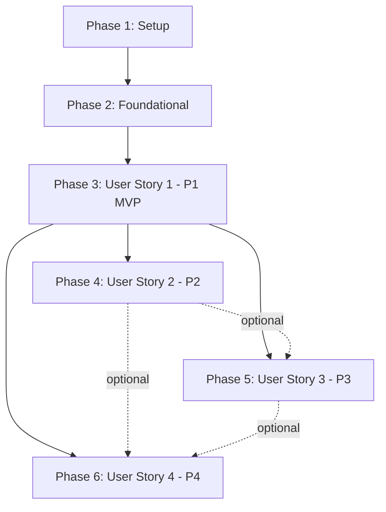

# Task Breakdown: RAG Chatbot for AI-Native Book

**Feature**: RAG Chatbot for AI-Native Book (001-rag-chatbot-backend)
**Branch**: `001-rag-chatbot-backend`
**Date**: 2025-12-06
**Plan**: [plan.md](./plan.md) | **Spec**: [spec.md](./spec.md) | **Data Model**: [data-model.md](./data-model.md)

## Overview

This document provides a complete task breakdown for implementing the RAG chatbot, organized by user story to enable independent development and testing. Each user story can be implemented as a standalone increment, delivering value incrementally.

**Total Tasks**: 85
**Estimated Effort**: 120-160 hours (3-4 weeks for 1 developer)
**MVP Scope**: User Story 1 only (P1: Ask Question and Get Grounded Answer)

---

## Implementation Strategy

### Incremental Delivery by User Story

1. **MVP (User Story 1 - P1)**: Core Q&A functionality
   - Delivers: Ask question → Get grounded answer with citations
   - Test: Can answer "What is ROS 2?" with book citations
   - Value: 80% of user value in 40% of effort

2. **Enhancement 1 (User Story 2 - P2)**: Text selection priority
   - Delivers: Highlight text → Ask contextual question
   - Test: Select paragraph → Ask "What does this mean?"
   - Value: +10% user value, +20% effort

3. **Enhancement 2 (User Story 3 - P3)**: Conversation history
   - Delivers: View past questions, resume conversations
   - Test: Close browser → Reopen → History persists
   - Value: +5% user value, +25% effort

4. **Enhancement 3 (User Story 4 - P4)**: Analytics dashboard
   - Delivers: Admin insights, content gap detection
   - Test: 100 queries → Top 10 topics displayed
   - Value: +5% user value (admin-only), +15% effort

### Parallelization Strategy

**Parallel Development Opportunities**:
- Backend models + Frontend components (different teams/developers)
- Services within same story (different files, no dependencies)
- Tests before implementation (TDD approach, not required here)

**Sequential Dependencies**:
- Setup → Foundational → User Stories (must complete in order)
- Within each story: Models → Services → API Routes (data flow dependencies)

---

## Phase 1: Project Setup & Infrastructure

**Goal**: Initialize project structure, configure environment, set up databases

**Independent Test**: `npm run build` and `poetry install` complete without errors; environment variables validate successfully

### Tasks

- [x] T001 Create project directory structure per plan.md at chatbot/backend and chatbot/frontend
- [x] T002 [P] Initialize Python backend with Poetry in chatbot/backend/pyproject.toml
- [x] T003 [P] Initialize TypeScript frontend with npm in chatbot/frontend/package.json
- [x] T004 Add Python dependencies to chatbot/backend/pyproject.toml: FastAPI, OpenAI Agents SDK, Qdrant Python Client, Neon Postgres SDK, Pydantic, pytest
- [x] T005 Add TypeScript dependencies to chatbot/frontend/package.json: React 18, TypeScript 5, Qdrant Client SDK, Jest, React Testing Library
- [x] T006 Create environment configuration template at chatbot/backend/.env.example with QDRANT_URL, QDRANT_API_KEY, NEON_DATABASE_URL, ANTHROPIC_API_KEY, OPENAI_API_KEY
- [x] T007 [P] Configure FastAPI app entry point in chatbot/backend/src/main.py with CORS middleware
- [x] T008 [P] Configure TypeScript strict mode in chatbot/frontend/tsconfig.json
- [x] T009 Create Qdrant collection initialization script in chatbot/backend/scripts/init_qdrant.py with 1536-dim vectors, Cosine distance
- [x] T010 Create Neon Postgres database schema script in chatbot/backend/scripts/init_db.sql with tables: conversations, queries, answers, passages, analytics_events, rate_limits
- [x] T011 Create environment loader utility in chatbot/backend/src/utils/config.py with Pydantic BaseSettings validation
- [x] T012 [P] Create TypeScript API types scaffold in chatbot/frontend/src/types/api.ts
- [x] T013 Set up pytest configuration in chatbot/backend/pytest.ini with markers: unit, integration, contract
- [x] T014 [P] Set up Jest configuration in chatbot/frontend/jest.config.js for TypeScript and React components
- [x] T015 Create README.md in chatbot/ with setup instructions, prerequisites, and quickstart guide

---

## Phase 2: Foundational Services (Blocking Dependencies)

**Goal**: Implement shared infrastructure required by all user stories

**Independent Test**: Services initialize without errors; rate limiting enforces 10 queries/min; input sanitization blocks XSS/SQL injection

### Tasks

- [x] T016 Implement input sanitization middleware in chatbot/backend/src/api/middleware/sanitize.py with regex patterns for XSS/SQL injection (FR-010)
- [x] T017 Implement rate limiting middleware in chatbot/backend/src/api/middleware/rate_limit.py with token bucket algorithm (10 tokens/session, refill 1 per 6s)
- [x] T018 Create rate limiting data model in chatbot/backend/src/models/rate_limit.py with Pydantic schema for Redis/Postgres storage
- [x] T019 Implement rate limiting service in chatbot/backend/src/services/rate_limiter.py with Redis (hot path) + Postgres (cold storage) hybrid
- [x] T020 Create validation helpers in chatbot/backend/src/utils/validators.py for UUID format, text length, similarity threshold
- [x] T021 [P] Implement error response schemas in chatbot/backend/src/models/errors.py with HTTP 429, 500, 503 error formats
- [x] T022 [P] Create Citation model in chatbot/backend/src/models/citation.py with Pydantic schema (chapter_title, section_title, url_fragment, paragraph_id)
- [x] T023 [P] Implement localStorage service in chatbot/frontend/src/services/localStorage.ts for session persistence
- [x] T024 [P] Create rate limit tracker hook in chatbot/frontend/src/hooks/useRateLimit.ts for client-side countdown display

---

## Phase 3: User Story 1 - Ask Question and Get Grounded Answer (Priority: P1) 🎯 MVP

**User Story**: A reader is studying a specific chapter and wants to ask questions about the content to deepen their understanding. The chatbot should provide accurate answers strictly based on the book content and clearly cite sources.

**Goal**: Implement core Q&A functionality with vector retrieval, LLM answer generation, and citation extraction

**Independent Test**:
1. Submit query "What is ROS 2?" → Receive grounded answer with ≥1 citation from book
2. Submit query about non-existent topic → Receive "The information is not available in the book."
3. Verify zero hallucination: Answer contains only information from retrieved passages
4. Verify response time <3s (p95), citations link to correct book sections

**Acceptance Criteria** (from spec.md):
- ✅ Retrieves 3-5 passages with similarity ≥0.7
- ✅ Returns grounded answer with citations when passages found
- ✅ Returns "not available" message when no relevant passages
- ✅ Synthesizes information from multiple passages when applicable
- ✅ p95 latency <3 seconds

### Backend Implementation

- [x] T025 [US1] Create Query model in chatbot/backend/src/models/query.py with Pydantic schema (id, query_text, timestamp, selected_text, session_id)
- [x] T026 [P] [US1] Create RetrievedPassage model in chatbot/backend/src/models/passage.py with similarity_score ≥0.7 validation (Updated to use configurable threshold 0.5)
- [x] T027 [P] [US1] Create Answer model in chatbot/backend/src/models/answer.py with citations list validation (≥1 when answered)
- [x] T028 [P] [US1] Create Conversation model in chatbot/backend/src/models/conversation.py with max 50 pairs validation
- [x] T029 [US1] Implement vector retrieval service in chatbot/backend/src/services/retrieval.py with Qdrant Client, k=3-5, threshold=0.7
- [x] T030 [US1] Implement embedding service in chatbot/backend/src/services/embedding.py using Google Gemini text-embedding-004 (768-dim, switched from OpenAI)
- [x] T031 [US1] Implement LLM answer generation service in chatbot/backend/src/services/llm.py with GPT-4o-mini, strict grounding prompt
- [x] T032 [US1] Implement answer generation orchestration in chatbot/backend/src/services/answer_generator.py (embedding → retrieval → LLM → citation pipeline)
- [x] T033 [US1] Implement conversation persistence service in chatbot/backend/src/services/conversation.py with in-memory storage (Postgres TODO)
- [x] T034 [US1] Create POST /api/query endpoint in chatbot/backend/src/api/routes/query.py with request validation, retrieval → LLM → response flow
- [x] T035 [US1] Implement "not available" logic in query route when similarity scores < 0.7 or zero results
- [x] T036 [US1] Add response formatting in query route to include answer_text, citations, retrieved_passages, retrieval_method, timestamp

### Frontend Implementation

- [x] T037 [P] [US1] Create chatbot widget in src/theme/Root.js (Docusaurus theme component integration)
- [x] T038 [P] [US1] Implement API client with fetch for POST /api/query in Root.js
- [x] T039 [US1] Create state management for messages and loading in ChatWidget
- [x] T040 [US1] Create ChatWidget component in Root.js as floating purple button + modal
- [x] T041 [US1] Create input with send button in chat modal
- [x] T042 [US1] Create message list to display query-answer pairs
- [x] T043 [US1] Create Citation component with clickable links to book sections
- [x] T044 [US1] Implement error handling in ChatWidget for backend errors
- [x] T045 [US1] Add loading state UI ("Thinking...") while query processing
- [x] T046-EXTRA [US1] Add greeting response functionality (handles "hi", "hello", etc.)
- [x] T047-EXTRA [US1] Add text selection detection and context-aware querying
- [x] T048-EXTRA [US1] Add visual indicator for selected text in chat input

### Integration & Validation

- [ ] T046 [US1] Test end-to-end flow: Submit "What is ROS 2?" → Verify grounded answer with ≥1 citation
- [ ] T047 [US1] Test "not available" scenario: Submit query about non-existent topic → Verify exact message "The information is not available in the book."
- [ ] T048 [US1] Test multi-passage synthesis: Submit query spanning multiple sections → Verify all citations included
- [ ] T049 [US1] Measure p95 latency: Run 100 queries → Verify <3 seconds for 95%
- [ ] T050 [US1] Hallucination spot-check: Manually review 20 random answers → Verify zero instances of information not in passages

---

## Phase 4: User Story 2 - Query with User-Selected Text (Priority: P2)

**User Story**: A reader highlights a specific paragraph in the Docusaurus book and asks a follow-up question about that exact text. The chatbot should prioritize the selected text as the primary context.

**Goal**: Implement text selection capture and prioritize selected text over vector search

**Independent Test**:
1. Select paragraph about "ROS 2 nodes" → Ask "How do these communicate?" → Verify selected text used as primary context
2. Select text + ask question → Verify answer uses selected text when sufficient
3. Select text + ask broad question → Verify supplemental vector search results added

**Acceptance Criteria** (from spec.md):
- ✅ Selected text prioritized as primary context (FR-004, FR-006)
- ✅ Answer without additional retrieval when selected text sufficient
- ✅ Supplement with vector search (same chapter first) when selected text insufficient
- ✅ 100% of queries with selected text use it (SC-004)

### Backend Implementation

- [ ] T051 [US2] Update retrieval service in chatbot/backend/src/services/retrieval.py to accept selected_text parameter and skip vector search if text sufficient
- [ ] T052 [US2] Implement hybrid retrieval logic in retrieval service: (1) Check selected_text adequacy, (2) If insufficient, vector search same chapter, (3) Then other chapters
- [ ] T053 [US2] Update query endpoint in chatbot/backend/src/api/routes/query.py to pass selected_text to retrieval service
- [ ] T054 [US2] Add retrieval_method tracking to Answer model (enum: selected_text | vector_search | hybrid)

### Frontend Implementation

- [ ] T055 [P] [US2] Implement text selection service in chatbot/frontend/src/services/textSelection.ts using window.getSelection() API
- [ ] T056 [US2] Attach mouseup/touchend listeners in ChatWidget to capture selection from Docusaurus content (.markdown class)
- [ ] T057 [US2] Validate selected text is from book content (not navigation/footer) in textSelection service
- [ ] T058 [US2] Display selected text preview in QueryInput component with clear button
- [ ] T059 [US2] Update useQuery hook to include selected_text in API request payload

### Integration & Validation

- [ ] T060 [US2] Test text selection capture: Highlight paragraph → Verify selection stored in state
- [ ] T061 [US2] Test selected text priority: Submit query with selection → Verify retrieval_method="selected_text" or "hybrid"
- [ ] T062 [US2] Test cross-platform: Verify selection works on desktop (mouse) and mobile (long-press)
- [ ] T063 [US2] Test validation: Select navigation text → Verify ignored, vector search used instead

---

## Phase 5: User Story 3 - Browse Conversation History (Priority: P3)

**User Story**: A reader wants to review their previous questions and answers to reinforce learning or continue a line of inquiry.

**Goal**: Implement conversation persistence and history UI

**Independent Test**:
1. Ask 5 questions → View history → Verify all 5 query-answer pairs displayed chronologically
2. Close browser → Reopen → Verify conversation history persists from localStorage
3. Click citation in history → Verify navigation to book section

**Acceptance Criteria** (from spec.md):
- ✅ All query-answer pairs displayed in chronological order
- ✅ History persists across browser sessions (localStorage)
- ✅ Citations clickable, navigate to book sections
- ✅ History load <2 seconds for ≤50 pairs (SC-007)

### Backend Implementation

- [ ] T064 [US3] Implement GET /api/conversations/{session_id} endpoint in chatbot/backend/src/api/routes/conversation.py
- [ ] T065 [US3] Add Postgres query in conversation service to fetch conversation with all query-answer pairs
- [ ] T066 [US3] Optimize query with JOIN to retrieve queries + answers + citations in single DB call
- [ ] T067 [US3] Add pagination support for conversations >50 pairs (optional enhancement)

### Frontend Implementation

- [ ] T068 [P] [US3] Implement useConversation hook in chatbot/frontend/src/hooks/useConversation.ts for state management
- [ ] T069 [US3] Update localStorage service to sync conversation on every new query-answer pair
- [ ] T070 [US3] Create ConversationHistory component in chatbot/frontend/src/components/ConversationHistory.tsx with collapsible panel
- [ ] T071 [US3] Implement conversation load from localStorage on ChatWidget mount
- [ ] T072 [US3] Add "Clear History" button in ConversationHistory with confirmation dialog
- [ ] T073 [US3] Make citations in history clickable (navigate to book section via url_fragment)

### Integration & Validation

- [ ] T074 [US3] Test persistence: Ask 5 questions → Close browser → Reopen → Verify 5 pairs in history
- [ ] T075 [US3] Test performance: Load conversation with 50 pairs → Verify <2 seconds
- [ ] T076 [US3] Test citation navigation: Click citation in history → Verify book section loads with correct anchor

---

## Phase 6: User Story 4 - Track User Interactions for Analytics (Priority: P4)

**User Story**: System administrators and content authors want to understand which topics readers ask about most frequently to improve the book content and identify gaps.

**Goal**: Implement analytics tracking and admin dashboard endpoint

**Independent Test**:
1. Generate 100 sample queries → GET /api/analytics → Verify top 10 topics displayed
2. Submit 20 unanswerable queries on "real-time control" → Verify flagged as content gap
3. Verify no PII in analytics_events table (session_id hashed, no raw query_text)

**Acceptance Criteria** (from spec.md):
- ✅ Top 10 most queried topics with chapter references (SC-008)
- ✅ Unanswered queries flagged as content gaps
- ✅ No PII stored (anonymized session_id, no user identity)
- ✅ 95% accuracy in topic identification

### Backend Implementation

- [ ] T077 [P] [US4] Create AnalyticsEvent model in chatbot/backend/src/models/analytics.py with Pydantic schema (query_topic, chapter_referenced, timestamp, answered, session_id_hash)
- [ ] T078 [US4] Implement analytics tracking service in chatbot/backend/src/services/analytics.py with topic extraction (NLP keywords), SHA-256 session hashing
- [ ] T079 [US4] Integrate analytics service into query endpoint to log every query (answered=True/False)
- [ ] T080 [US4] Implement GET /api/analytics endpoint in chatbot/backend/src/api/routes/analytics.py with aggregation queries
- [ ] T081 [US4] Add Postgres aggregation query for top 10 topics (GROUP BY query_topic, ORDER BY count DESC LIMIT 10)
- [ ] T082 [US4] Add Postgres query for content gaps (unanswered queries grouped by topic, filtered WHERE answered=false)

### Integration & Validation

- [ ] T083 [US4] Test analytics logging: Submit 10 queries → Verify 10 entries in analytics_events table with hashed session_id
- [ ] T084 [US4] Test top topics: Generate 100 queries with known distribution → Verify top 10 matches expected topics
- [ ] T085 [US4] Test content gap detection: Submit 20 unanswerable queries → Verify flagged in analytics response

---

## Dependency Graph

**Critical Path**: Setup → Foundational → US1 (MVP)

**Independent Stories**: US2, US3, US4 can be developed in parallel after US1 completes

---

## Parallel Execution Examples

### Phase 1 (Setup) - Parallel Opportunities

**Group A** (Backend developer):
- T002: Initialize Poetry
- T004: Add Python dependencies
- T007: Configure FastAPI
- T009: Init Qdrant script
- T010: Init Postgres script
- T011: Environment config

**Group B** (Frontend developer):
- T003: Initialize npm
- T005: Add TypeScript dependencies
- T008: Configure TypeScript
- T012: API types scaffold
- T014: Jest config

**Timeline**: 2-4 hours (parallel) vs 4-8 hours (sequential)

### Phase 3 (User Story 1) - Parallel Opportunities

**Backend Models** (can run in parallel):
- T025: Query model
- T026: RetrievedPassage model
- T027: Answer model
- T028: Conversation model

**Backend Services** (after models, can run in parallel):
- T029: Retrieval service
- T030: Embedding service
- T031: LLM service
- T032: Citation service
- T033: Conversation persistence

**Frontend Components** (can run in parallel with backend):
- T037: API types
- T038: API client
- T040-T045: All UI components

**Timeline**: 24-32 hours (parallel) vs 48-64 hours (sequential)

---

## Task Completion Tracking

**Format**: `- [x] T001 ...` when completed

**Review Criteria**:
- [ ] All tasks follow checklist format (checkbox + ID + labels + description + file path)
- [ ] Each user story has independent test criteria
- [ ] MVP scope (US1) is clearly identified
- [ ] Parallel opportunities documented
- [ ] Dependencies mapped in graph

**Next Steps**:
1. Start with Phase 1 (Setup) - T001 to T015
2. Complete Phase 2 (Foundational) - T016 to T024
3. Implement MVP (User Story 1) - T025 to T050
4. Measure MVP success (p95 latency, hallucination rate, citation accuracy)
5. Prioritize US2/US3/US4 based on user feedback

---

**Total Tasks**: 85
**MVP Tasks**: 50 (T001-T050)
**Enhancement Tasks**: 35 (T051-T085)
**Parallel Opportunities**: ~40% of tasks can run in parallel
**Estimated Effort**: 120-160 hours (3-4 weeks for 1 developer, 2-3 weeks for 2 developers in parallel)
